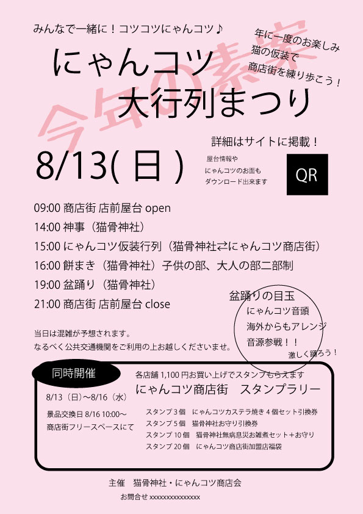

| 項目 | 設定例 |
| --- | --- |
| タイトル | にゃんコツ大行列まつりのお知らせ |
| URLエイリアス | /news/2 |
| メディア | festival.jpg |
| 掲載日 |2023/06/10 |
| 店舗 | にゃんコツ神社 / 御菓子処　ながゐ / 酒倉 / バーバ ダンディ/ :ecru / 本と文具の光琳堂 / 猫の洋菓子店 |
| 本文 |↓に記載|

## 開催概要

開催日時：8月13日(日)〜16日(水) 
　※メインは13日（日） 
　※13〜16日は商店街のスタンプラリー期間 
主催：猫骨神社・にゃんコツ商店会

## プログラム内容

8月13日： 
　09:00 商店会の店前屋台open 
　14:00 神事（猫骨神社） 
　15:00 にゃんコツ仮装行列（猫骨神社⇄にゃんコツ商店街） 
　16:00 餅まき（猫骨神社）子供の部、大人の部二部制 
　19:00 盆踊り 
　21:00 商店会の店前屋台close

## その他イベント

開催期間中は、にゃんコツスタンプラリーを開催します！集めたスタンプの数に応じてもらえる景品のグレードが上がります。

* スタンプ３個　にゃんコツカステラ焼き4個セット引換券
* スタンプ５個　猫骨神社お守り引換券
* スタンプ10個　猫骨神社無病息災お雑煮セット＋お守り
* スタンプ20個　にゃんコツ商店街加盟店福袋

